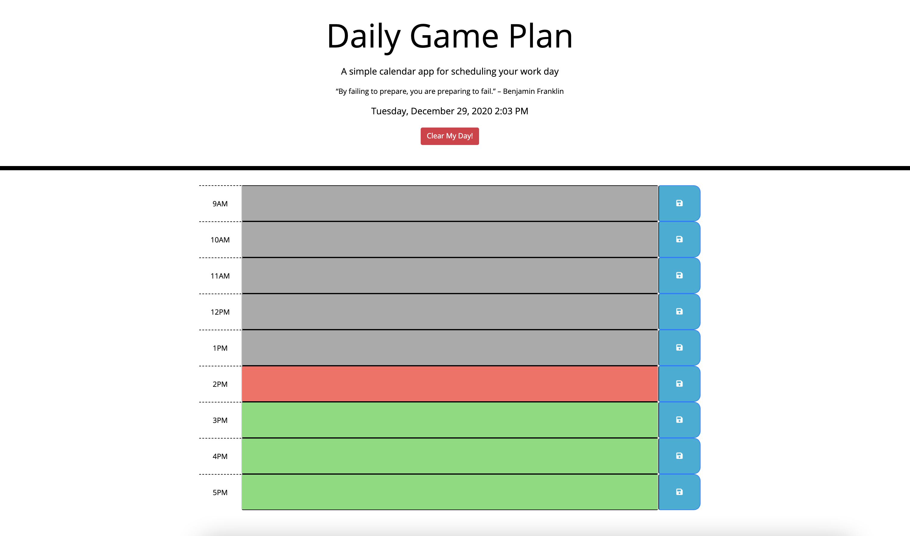

# daily_game_plan

## Introduction

Welcome to my repo for my Daily Game Plan. This is a web-based daily activity manager that helps to save tasks into hour-long blocks representing the traditional work hours.

## Instructions

- Click into the text field for any hour to write in your task. Click the Save button to save.
- To add, remove or edit, click into the field again. Remember to save your tasks each time.
- The time-blocks are color coded to the current time: Red for current hour, Grey for past hours, and Green for future hours. Use this to your advantage when quickly glancing over your day.
- Refreshing the button will not erase your tasks (as long as you remembered to save!).
- Use the Clear button to completely clear your day (be careful, you cannot retrieve your tasks after clearing).

## Preview

## Deployed Link

https://wdfhai.github.io/daily_game_plan/

## Special Mention

Thanks to the developers of Moment.js for creating code that helped me tremendously with linking my planner to time-based functions.

## Summary

Thanks again for visiting my Daily Game Plan repository. This required knowledge of Javascript, Jquery, Bootstrap as well as local storage and time-related queries using a third party library, which in this case was Moment.js.Cheers!
